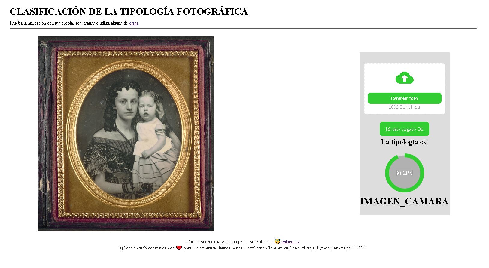

# Clasificación de la Tipología Fotográfica

Aplicación web basada en Inteligencia Artifical para identificar la tipología en fotografías históricas, para saber más de su propósito, funcionamiento y área de aplicación puedes visitar este
[enlace](https://github.com/gustavolsj/image-recognition)

Está basada en tensorflowJS, para desarrollarla seguí este [ejemplo,](https://rexsimiloluwah.github.io/PLANT-DISEASE-CLASSIFIER-WEB-APP-TENSORFLOWJS/) este [repositorio](https://github.com/rexsimiloluwah/PLANT-DISEASE-CLASSIFIER-WEB-APP-TENSORFLOWJS) y este [tutorial](https://rexsimiloluwa.medium.com/building-a-plant-disease-classification-web-app-in-keras-and-tensorflow-js-d435829213fa)
